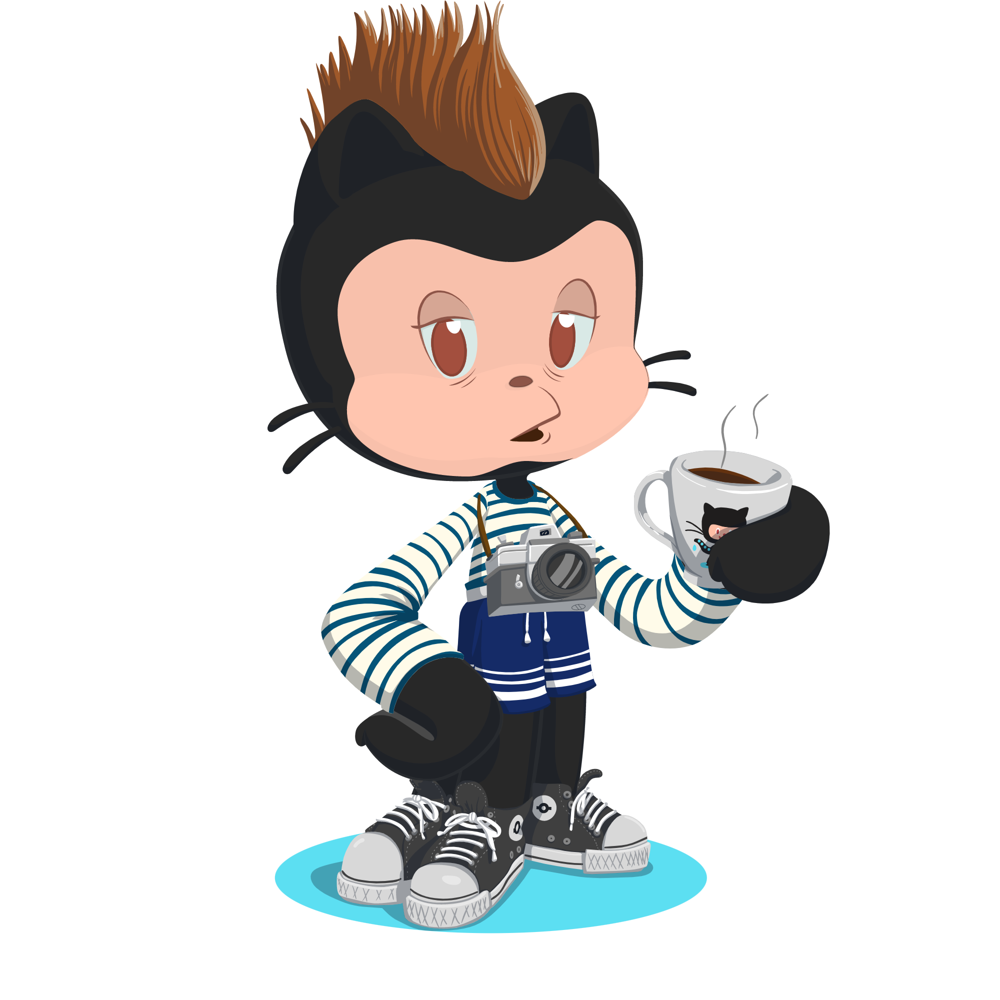
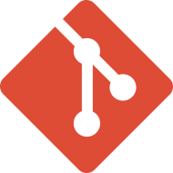

# 👋 Hola, Soy Sergio Simón Fernández 📢
<!-- 

 -->

&nbsp

Soy alumno del instituto **IES Gabriel García Márquez** estudiando Desarrollo de **Aplicaciones Multiplataforma** 👨‍🎓, actualmente en el segundo año. Ademas soy **técnico de sistemas microinformáticos y redes**👨‍💻.

<!-- Cuando mi vida me lo permite disfruto de salir con mi cámara y hacer fotos 📷, ~~aunque no son muy buenas~~🤡, me gusta ver películas raras algunas veces antiguas y otras cutres 🎥 ~~o todas ellas a la vez~~, también soy un friki ~~/ informático~~ de manual videojuegos,anime,manga,cómics 📺, disfruto de la lectura 📚, y salir con amigos a pasarlo bien por su puesto 🍻. Disfruto mucho haciendo siempre cosas nuevas y saliendo de mi zona de confort para expandir horizontes. -->

Aquí encontraras mi repositorio personal echa un ojo y pilla lo que quieras 😉. Ahora esta un poco vacío pero estoy en ello 🛠 👨‍🔧.

<!-- 

 -->

&nbsp

<h2 align="center"> 📫 Contacto </h2>

 Si quieres que hablemos un rato podemos, aqui tienes mis redes: 

&nbsp

<!-- 

 -->

<h2 align="center"> 🛠 Tecnologías </h2>

    
    
    

&nbsp

<!-- 

 -->

&nbsp

